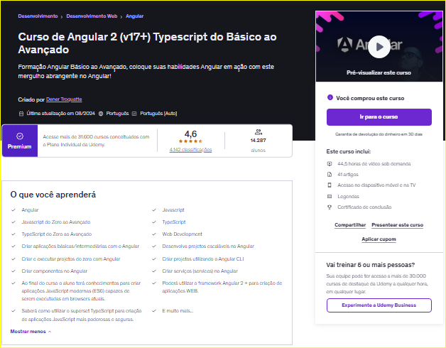

# ✨ Miriã Amaral - Formação Angular + Dashboard de Progresso de Estudos (Node.js + JSON) 🌐💻

<p align="center">
  
</p>

---

## 📊 Dashboard de Progresso

<!--PROGRESS_BADGES_START-->
<p align="center">


</p>
<!--PROGRESS_BADGES_END-->

---

## 🚀 Visão Geral do Aprendizado

<!--PROGRESS_CHART_START-->

<!--PROGRESS_CHART_END-->

---

### 🎯 Sobre este projeto

Este repositório é um sistema automatizado de acompanhamento de progresso de estudos baseado em:

- 📦 Estrutura de módulos organizada por tecnologia  
- 📁 Detecção de exercícios concluídos via arquivos locais  
- 🔁 Atualização automática via Node.js (`scanner.js`)  
- 📊 Dashboard visual gerado dinamicamente  

💡 Este projeto foi idealizado por mim e desenvolvido com o apoio de ferramentas como ChatGPT e Google Gemini, evoluindo através de múltiplas iterações, ajustes e melhorias contínuas.

---

## 💡 Diferenciais

- 📊 Dashboard automatizado de progresso  
- 🔁 Atualização dinâmica sem intervenção manual  
- 🧠 Estrutura orientada a dados (`course-map.json`)  
- 🛡️ Validação e auditoria de inconsistências  
- 📈 Escalável para qualquer tecnologia ou trilha de aprendizado  

---

## 🧠 Trilhas de Aprendizado

Este projeto suporta múltiplas trilhas de estudo, organizadas por tecnologia e nível de complexidade.

### 🟨 JavaScript & DOM
Base sólida da linguagem, manipulação do DOM e fundamentos avançados.

### 🟦 TypeScript
Tipagem estática, orientação a objetos e escalabilidade.

### 🟥 Angular
Framework moderno com componentes, reatividade e arquitetura SPA.

---

## ℹ️ Como o progresso é calculado

O progresso é baseado na proporção de exercícios concluídos em relação ao total de aulas cadastradas no `course-map.json`.

✔️ Cada aula concluída possui um arquivo `exercicio-concluido.md`  
✔️ O script `scanner.js` percorre automaticamente os módulos  
✔️ O README é atualizado dinamicamente com base nesses dados  

---

## ⚙️ Como funciona

1. O arquivo `course-map.json` define a estrutura dos módulos e aulas  
2. O script `scanner.js` percorre essa estrutura  
3. Para cada aula, verifica se existe `exercicio-concluido.md`  
4. Calcula o progresso por módulo e global  
5. Atualiza automaticamente este README  

---

## ▶️ Como executar

```bash
node scanner.js
```
---

## ✉️ Contato

- LinkedIn: [Miriã Amaral](https://www.linkedin.com/in/miriaamaralcs)  
- GitHub: [miriaamaral](https://github.com/miriaamaral)  
- Email: [miriaamaralcs@gmail.com](mailto:miriaamaralcs@gmail.com)  

---

<p align="center">
Feito com ❤️ por Miriã Amaral
</p>